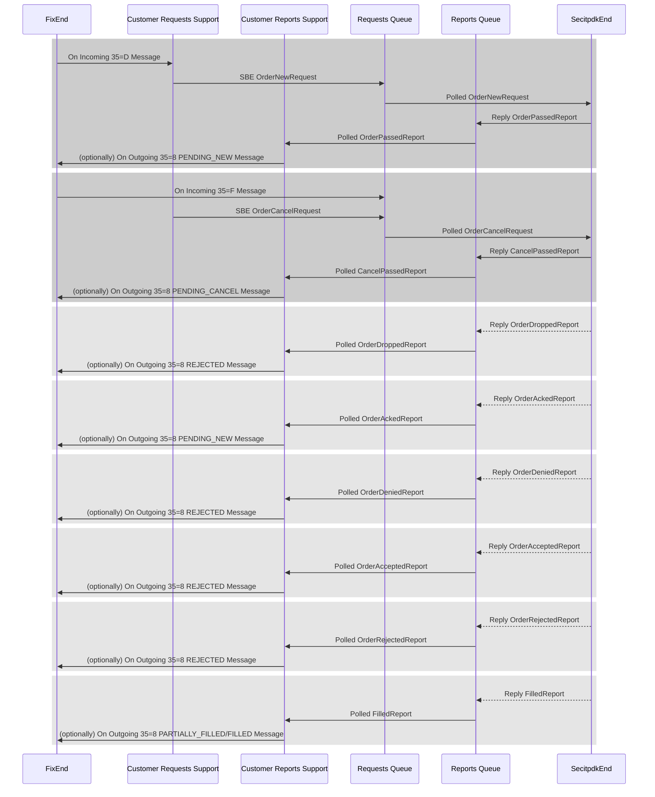
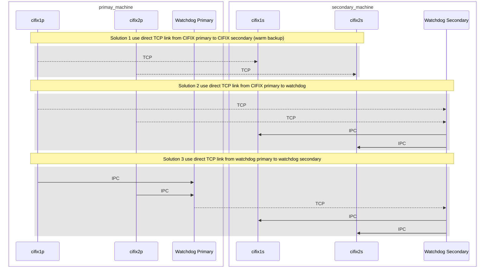

# Summary

CIFIX 的 v2 重新架构版，主要设计原则是：

1. 性能优先
2. 性能优先
3. 性能优先
4. 避免同步操作，避免锁，避免线程切换
5. 通过 MMAP 进行消息传递，消息使用 SBE 编码，避免 COPY
6. 针对客户作特定逻辑固化，以灵活性换性能

# Goals

CIFIX 网关的上下行延时进入`100μs`以下。

拟支持的业务类型：

1. 股票债券普通买卖交易
2. ETF 申赎交易
3. 信用交易
4. 旁路撤单交易
5. 旁路 Dropcopy

拟迁移的客户：

1. Optiver
2. JaneStreet
3. Morgan Stanley

# Non-Goals

* 将所有客户迁移到 CIFIX-v2 上来
* 实现所有的业务类型
* 支持客户的所有自定义需求

# Motivation

现阶段生产上QFII CIFIX的报单，网关内部时间大约为全程`300μs`。希望能将该时间压缩至上行下行全程`100μs`内。

# Description

## Bootstrap

服务由 Bootstrap 启动。启动过程中会去加载 BootstrapAware 的实现，并多线程调用其 start 方法；如果某实例同时实现了 BootstrapRestoringAware，会多线程调用其 restore 方法；如果某实例同时实现了 BootstrapReadyAware，会单线程依次调用其 ready 方法；

目前设计的实例有 FixEnd & SecitpdkEnd。

## IPC - ChronicleQueue

设计了两个 ChronicleQueue 来进行 IPC：requests & reports。

1. requests
    - 主要生产者是 FixEnd
    - 主要消费者是 SecitpdkEnd
    - 主要消息
        - OrderNewRequest: FIX `OrderSingle<D>` 消息
        - OrderCancelRequest: FIX `OrderCancelRequest<F>` 消息
        - OrderCancelByExchangeClOrderIdRequest: 旁路 FIX `OrderCancelRequest<F>` 消息
2. reports
    - 主要生产者是 SecitpdkEnd
    - 主要消费者是 FixEnd
    - 主要消息
        - RequestDeclinedReport
        - OrderPassedReport
        - OrderDroppedReport
        - OrderAckedReport
        - OrderDeniedReport
        - OrderAcceptedReport
        - OrderRejectedReport
        - CancelPassedReport
        - CancelDroppedReport
        - CancelAckedReport
        - CancelDeniedReport
        - CancelAcceptedReport
        - CancelRejectedReport
        - FilledReport

在异常恢复阶段，FixEnd & SecitpdkEnd 都会读取 requests & reports ChronicleQueue。



## FixEnd

主要实现:

1. 配置 QuickFIX/J 引擎
2. 启动 QuickFIX/J 监听端口
3. FIX 消息到 requests IPC 的转储
4. reports IPC 的消费以及通过 FIX 发送给客户

requests IPC 的链路处理逻辑：

1. 通过引擎的回调接口处理客户连发送的 FIX 消息(主要是 `D/F/0`)
2. 通过消息的 Session 信息来定位并调用客户的自定义逻辑
3. 将自定义逻辑处理后的 SBE 消息写入 requests IPC

ClOrdID<11> 的去重在此实现。

reports IPC 的链路处理逻辑：

1. 初始化 reports IPC 队列，读取 SBE 消息
2. 通过 OMS 定位到原始委托和/或原始撤单请求
3. 通过消息体里的 `sessionId` 来定位并调用客户的自定义逻辑
4. 根据自定义逻辑的处理结果，发送FIX消息给客户

## SecitpdkEnd

主要实现:

1. 配置并管理与 HTS 柜台的连接
1. requests IPC 的消费以及调用 itpdk-jni 发送给柜台
2. itpdk 回报到 reports IPC 的转储

requests IPC 链路处理逻辑：

1. 初始化 requests IPC 队列，读取 SBE 消息
2. 为 `OrderNewRequest` 生成一个 `OrderPassedReport` 并写入 reports IPC
3. 为 `OrderCancelRequest` 生成一个 `CancelPassedReport` 并写入 reports IPC
4. 将消息原样转发给 itpdk-JNI

reports IPC 链路处理逻辑：

1. 初始化 itpdk 接口回调函数
2. 在同一个线程中将 HTS 柜台回报转为 SBE 消息
3. 传递 SBE 消息到 itpdk-JNI 外
4. 将 SBE 消息写入 reports IPC

回报的去重在此实现。

回报的排序在此实现。

## FixEnd & SecitpdkEnd Interoperation

FixEnd & SecitpdkEnd 在布署时不必须在同一个实例里。

读取 requests & reports IPC 消息时，各线程会间隔地进行轮询。

为了降低等待延时，当FixEnd & SecitpdkEnd 在同一个实例中同时被启用时，会实现基于线程通信机制的轮询模式（TIMED WAIT）。

## Customer Support

在 FixEnd 处理逻辑上增加扩展点 CustomerSupport，用来支持客户的自定义需求。

1. 可以通过客户习惯的方式使用 FIX tag 来传资金账号、证券代码等
2. 可以支持 Tag 11 透传/映射两种模式
3. 可以支持不同客户额外的 FIX tag 需求 (有限支持)
4. 可以支持客户对于回报到 FIX `ExecType<150>` 的自定义映射支持

### Customer OnIncomingFixMessageTypeD

主要是处理 FIX `OrderSingle<D>` 的消息，将其转换为 `OrderNewRequestEncoder` 格式的 SBE 消息；如果不能转换为合法的消息，会直接抛出异常，该异常会被转译为 `RequestDeclinedReportEncoder` 格式消息。处理之后的 SBE 消息会写入到 IPC 中。

主要方法定义：

```java
<T extends MessageEncoderFlyweight> T newMoreOrderNewRequestEncoder();

<T extends MessageEncoderFlyweight> void onIncomingMessage(
    final FixMessageTrace trace,
    final FixMessageAccessor msg,
    final FixClientOrderIdMappings mappings,
    final OrderNewRequestEncoder fixedEncoder,
    final T moreEncoder)
throws FieldNotFound, IncorrectTagValue, IncorrectDataFormat, DuplicatedTag11Exception;
```

FIX 引擎在回调线程中会调用到 `onIncomingMessage` 方法。

该方法为不同的客户实现各自的逻辑：如通过哪个FIX tag来获取交易账号、通过哪个FIX tag来获取证券代码等。

比较重要的扩展点：

1. Tag11 的处理需要通过 `FixClientOrderIdMappings` 来进行
2. 各客户相关的自定义字段由 `<T extends MessageEncoderFlyweight>` 类来实现

### Customer OnIncomingFixMessageTypeF

主要是处理 FIX `OrderCancelRequest<F>` 的消息，将其转换为 `OrderCancelRequestEncoder` 格式的 SBE 消息；如果不能转换为合法的消息，会直接抛出异常，该异常会被转译为 `RequestDeclinedReportEncoder` 格式消息。处理之后的 SBE 消息会写入到 IPC 中。

主要方法定义：

```java
<T extends MessageEncoderFlyweight> T newMoreOrderCancelRequestEncoder();

<T extends MessageEncoderFlyweight> void onIncomingMessage(
    final FixMessageTrace trace,
    final FixMessageAccessor msg,
    final FixClientOrderIdMappings mappings,
    final OrderCancelRequestEncoder fixedEncoder,
    final T moreEncoder)
throws FieldNotFound, IncorrectTagValue, IncorrectDataFormat, DuplicatedTag11Exception, Tag41NotExistedException;
```

FIX 引擎在回调线程中会调用到 `onIncomingMessage` 方法。

该方法为不同的客户实现各自的逻辑：如通过哪个FIX tag来获取交易账号、通过哪个FIX tag来获取证券代码等。

比较重要的扩展点：

1. Tag11 的处理需要通过 `FixClientOrderIdMappings` 来进行
2. Tag41 的处理需要通过 `FixClientOrderIdMappings` 来进行
3. origClOrdId 与 Tag41 的映射关系通过 `FixClientOrderIdMappings` 来进行
4. 各客户相关的自定义字段由 `<T extends MessageEncoderFlyweight>` 类来实现

### Customer OnOutgoingRequestDeclinedReport

主要是处理由于消息不合法而在 `OnIncomingFixMessageTypeD` & `OnIncomingFixMessageTypeF` 中生成的 `RequestDeclinedReport` 消息。该方法在轮询 IPC 的线程中被执行。

```java
boolean onOutgoingReport(
    final RequestDeclinedDecoder report,
    final FixMessageMutator outMsg);
```

该方法解析 SBE 消息，根据客户的需求确定是否以及如何转换为 FIX 消息。

实际的实现会将 `RequestDeclinedReport` 转换为合适的 `ExecutionReport<8>` 或 `OrderCancelReject<9>` 或 `Reject<3>` FIX 消息。

### Customer OrderPassedReportDecoder

主要是处理 `OrderPassedReport` 消息。该消息是 `OrderNewRequest` 的简单别名，在语义上是 SecitpdkEnd 对 `OrderNewRequest` 的确认回报。

```java
<T extends MessageEncoderFlyweight> FixOrder createOrder(
    final OrderPassedReportDecoder report,
    final T more);
```

该方法是从 `OrderPassedReport` 中解析出客户自定的 `FixOrder` 对象。返回的 `FixOrder` 中会有一些客户额外的 FIX Tag，用于生成后续的 `ExecutionReport<8>` 消息。该方法在轮询 IPC 的线程中被执行。

```java
<T extends MessageEncoderFlyweight> T newMoreOrderNewRequestDecoder();
```

该方法与 `OnIncomingFixMessageTypeD` 中的 `newMoreOrderNewRequestEncoder` 对应。该方法会在服务启动过程中调用一次，结果会缓存在线程本地对象中。

```java
<T extends MessageEncoderFlyweight> boolean onOutgoingReport(
    final FixOrder order,
    final OrderPassedReportDecoder report,
    final T more,
    final FixMessageMutator outMsg);
```

该方法解析 SBE 消息，根据客户的需求确定是否以及如何转换为 FIX 消息。该方法在轮询 IPC 的线程中被执行。

`OrderPassedReport` 可以被转换为 `ExecType<150>=PENDING_NEW(A)` 的FIX ExecutionReport<8> 消息。

### Customer OrderDroppedReportDecoder

主要是处理 `OrderDroppedReport`。该消息在语义上是 SecitpdkEnd 对 `OrderNewRequest` 的拒单回报（比如业务类型不支持、账户未配置等）。

```java
boolean onOutgoingReport(
    final FixOrder order,
    final OrderDroppedReportDecoder report,
    final FixMessageMutator outMsg);
```

该方法解析 SBE 消息，根据客户的需求确定是否以及如何转换为 FIX 消息。该方法在轮询 IPC 的线程中被执行。

`OrderDroppedReport` 可以被转换为 `ExecType<150>=REJECTED(8)` 的FIX `ExecutionReport<8>` 消息。

### Customer OrderAckedReportDecoder

主要是处理 `OrderAckedReport`。该消息在语义上是 HTS 柜台对 `OrderNewRequest` 的确认回报。

```java
boolean onOutgoingReport(
    final FixOrder order,
    final OrderAckedReportDecoder report,
    final FixMessageMutator outMsg);
```

该方法解析 SBE 消息，根据客户的需求确定是否以及如何转换为 FIX 消息。该方法在轮询 IPC 的线程中被执行。

`OrderAckedReport` 可以被转换为 `ExecType<150>=PENDING_NEW(A)` 的FIX `ExecutionReport<8>` 消息。

### Customer OrderDeniedReportDecoder

主要是处理 `OrderDeniedReport`。该消息在语义上是 HTS 柜台对 `OrderNewRequest` 的拒单回报。

```java
boolean onOutgoingReport(
    final FixOrder order,
    final OrderDeniedReportDecoder report,
    final FixMessageMutator outMsg);
```

该方法解析 SBE 消息，根据客户的需求确定是否以及如何转换为 FIX 消息。该方法在轮询 IPC 的线程中被执行。

`OrderDroppedReport` 可以被转换为 `ExecType<150>=REJECTED(8)` 的FIX `ExecutionReport<8>` 消息。

### Customer OrderAcceptedReportDecoder

主要是处理 `OrderAcceptedReport`。该消息在语义上是交易所对 `OrderNewRequest` 的确认回报。

```java
boolean onOutgoingReport(
    final FixOrder order,
    final OrderAcceptedReportDecoder report,
    final FixMessageMutator outMsg);
```

该方法解析 SBE 消息，根据客户的需求确定是否以及如何转换为 FIX 消息。

`OrderAcceptedReport` 可以被转换为 `ExecType<150>=NEW(0)` 的FIX `ExecutionReport<8>` 消息。

### Customer OrderRejectedReportDecoder

主要是处理 `OrderRejectedReport`。该消息在语义上是交易所对 `OrderNewRequest` 的拒单回报。

```java
boolean onOutgoingReport(
    final FixOrder order,
    final OrderRejectedReportDecoder report,
    final FixMessageMutator outMsg);
```

该方法解析 SBE 消息，根据客户的需求确定是否以及如何转换为 FIX 消息。

`OrderRejectedReport` 可以被转换为 `ExecType<150>=REJECTED(8)` 的FIX `ExecutionReport<8>` 消息。

### Customer FilledReportDecoder

主要是处理 `FilledReport`。该消息在语义上是交易所的成交回报。

```java
boolean onOutgoingReport(
    final FixOrder order,
    final FilledReportDecoder report,
    final FixMessageMutator outMsg);
```

该方法解析 SBE 消息，根据客户的需求确定是否以及如何转换为 FIX 消息。

`FilledReport` 可以被转换为 `ExecType<150>=PARTIALLY_FILLED(1)` 或 `ExecType<150>=FILLED(2)`  或 `ExecType<150>=TRADE(F)` 的FIX `ExecutionReport<8>` 消息。

### Customer CancelPassedReportDecoder

主要是处理 `CancelPassedReport`。该消息在语义上是 SecitpdkEnd 对 `OrderCancelRequest` 的确认回报。

```java
<T extends MessageEncoderFlyweight> FixCancel createCancel(
    final CancelPassedReportDecoder report,
    final T more);
```

该方法是从 `CancelPassedReport` 中解析出客户自定的 `FixCancel` 对象。返回的 `FixCancel` 中会有一些客户额外的 FIX Tag，用于生成后续的 `ExecutionReport<8>` 或 `OrderCancelReject<9>` 消息。该方法在轮询 IPC 的线程中被执行。

```java
<T extends MessageEncoderFlyweight> T newMoreOrderCancelRequestDecoder();
```

该方法与 `OnIncomingFixMessageTypeF` 中的 `newMoreOrderCancelRequestEncoder` 对应。该方法会在服务启动过程中调用一次，结果会缓存在线程本地对象中。

```java
<T extends MessageEncoderFlyweight> boolean onOutgoingReport(
    final FixOrder order,
    final FixCancel cancel,
    final CancelPassedReportDecoder report,
    final T more,
    final FixMessageMutator outMsg);

<T extends MessageEncoderFlyweight> boolean onOutgoingReport(
    final FixCancel cancel,
    final CancelPassedReportDecoder report,
    final T more,
    final FixMessageMutator outMsg);
```

以上两个方法对应于是否找到原始委托，主要是解析 SBE 消息，根据客户的需求确定是否以及如何转换为 FIX 消息。该方法在轮询 IPC 的线程中被执行。

`CancelPassedReport` 可以被转换为 `ExecType<150>=PENDING_CANCEL(6)` 的FIX `ExecutionReport<8>` 或 `OrderCancelReject<9>` 消息。

### Customer CancelDroppedReportDecoder

主要是处理 `CancelDroppedReport`。该消息在语义上是 SecitpdkEnd 对 `OrderCancelRequest` 的拒单回报。

```java
boolean onOutgoingReport(
    final FixOrder order,
    @Nullable final FixCancel cancel,
    final CancelDroppedReportDecoder report,
    final FixMessageMutator outMsg);
```

该方法解析 SBE 消息，根据客户的需求确定是否以及如何转换为 FIX 消息。该方法在轮询 IPC 的线程中被执行。

`CancelDroppedReport` 可以被转换为 FIX `OrderCancelReject<9>` 消息。

### Customer CancelAckedReportDecoder

主要是处理 `CancelAckedReport`。该消息在语义上是 HTS 柜台对 `OrderCancelRequest` 的确认回报。

```java
boolean onOutgoingReport(
    final FixOrder order,
    @Nullable final FixCancel cancel,
    final CancelAckedReportDecoder report,
    final FixMessageMutator outMsg);
```

该方法解析 SBE 消息，根据客户的需求确定是否以及如何转换为 FIX 消息。该方法在轮询 IPC 的线程中被执行。

`CancelAckedReport` 可以被转换为 `ExecType<150>=PENDING_CANCEL(6)` 的FIX `ExecutionReport<8>` 消息。

### Customer CancelDeniedReportDecoder

主要是处理 `CancelDeniedReport`。该消息在语义上是 HTS 柜台对 `OrderCancelRequest` 的拒单回报。

```java
boolean onOutgoingReport(
    final FixOrder order,
    @Nullable final FixCancel cancel,
    final CancelDeniedReportDecoder report,
    final FixMessageFlyweights.FixMessageMutator outMsg);
```

该方法解析 SBE 消息，根据客户的需求确定是否以及如何转换为 FIX 消息。该方法在轮询 IPC 的线程中被执行。

`CancelDeniedReport` 可以被转换为 FIX `OrderCancelReject<9>` 消息。

### Customer CancelAcceptedReportDecoder

主要是处理 `CancelAcceptedReport`。该消息在语义上是交易所对 `OrderCancelRequest` 的确认回报。

```java
boolean onOutgoingReport(
    final FixOrder order,
    @Nullable final FixCancel cancel,
    final CancelAcceptedReportDecoder report,
    final FixMessageMutator outMsg);
```

该方法解析 SBE 消息，根据客户的需求确定是否以及如何转换为 FIX 消息。该方法在轮询 IPC 的线程中被执行。

`CancelAcceptedReport` 可以被转换为 `ExecType<150>=CANCELED(4)` 的FIX `ExecutionReport<8>` 消息。

### Customer CancelRejectedReportDecoder

主要是处理 `CancelRejectedReport`。该消息在语义上是交易所对 `OrderCancelRequest` 的拒单回报。

```java
boolean onOutgoingReport(
    final FixOrder order,
    @Nullable final FixCancel cancel,
    final CancelRejectedReportDecoder report,
    final FixMessageMutator outMsg);
```

该方法解析 SBE 消息，根据客户的需求确定是否以及如何转换为 FIX 消息。该方法在轮询 IPC 的线程中被执行。

`CancelRejectedReport` 可以被转换为 FIX `OrderCancelReject<9>` 消息。

## FixClientOrderIdMappings

主要是在处理请求过程中会被用到。

### Register `ClOrdID<11>` -> `clOrderId` Mappings

```java
boolean putIfAbsent(final String tag, final long id);
```

### Lookup `origClOrderId` by `OrigClOrdID<41>`

```java
long getIfPresent(final String tag);
```

### Cross Session Boundary

支持跨 Session 撤单。

因为：

1. 不同的 Session 处理是在不同的线程中，如果要撤不同 Session 的委托，可能有线程安全问题，需要增加额外的线程同步成本
2. 有的客户没有多 Session 需求

所以跨 Session 撤单功能默认不开启，需要显式开启。

### Order Mappings Cleanup

因为请求的处理与回报处理是在不同线程，所以 `FixClientOrderIdMappings` 不能直接感知委托的终结与否，存在 OOM 的风险。

在 FIX 引擎的 `HeartBeat<0>` 处理回调函数中，增加批量同步终结映射关系的支持，以利用空闲时间，降低线程同步对消息处理的影响。

## OMS Storage

主要是在处理回报过程中会被用到。

### OmsRepository

简单地维护 `emsClOrderId` 到 `FixOrder` 的映射关系。

```java
interface OmsRepository {
  void saveOrder(final FixOrder order);

  @Nullable FixOrder findOrderByEmsClOrderId(final long sessionId, final long emsClOrderId);
}
```

### FixOrder

存储通用的委托信息。

每一个委托由客户扩展的逻辑方法创建：

```java
<T extends MessageEncoderFlyweight> FixOrder createOrder(
    final OrderPassedReportDecoder report,
    final T more);
```

如果客户需要额外的委托信息，需要定义 `FixOrder` 的子类，比如添加 FIX 相关的字段。

### FixCancel

存储通用的撤单请求信息。

每一个委托由客户扩展的逻辑方法创建：

```java
<T extends MessageEncoderFlyweight> FixCancel createCancel(
    final CancelPassedReportDecoder report,
    final T more);
```

如果客户需要额外的请求信息，需要定义 `FixCancel` 的子类，比如添加 FIX 相关的字段。

### FixOrderState

FIX 协议状态机的简单实现：

| Precedence | OrdStatus            | Description                                                                                                                                                                                                      |
| ---        | ---                  | ---                                                                                                                                                                                                              |
| 11         | Pending Cancel       | Order with an Order Cancel Request pending, used to confirm receipt of an `Order Cancel Request <F>`. DOES NOT INDICATE THAT THE ORDER HAS BEEN CANCELED.                                                        |
| 10         | Pending Replace      | Order with an Order Cancel/Replace Request pending, used to confirm receipt of an `Order Cancel/Replace Request <G>`. DOES NOT INDICATE THAT THE ORDER HAS BEEN REPLACED.                                        |
| 9          | Done for Day         | Order not, or partially, filled; no further executions forthcoming for the trading day                                                                                                                           |
| 8          | Calculated           | Order has been completed for the day (either filled or done for day). `Commission<12>` or currency settlement details have been calculated and reported in this execution message                                |
| 7          | Filled               | Order completely filled, no remaining quantity                                                                                                                                                                   |
| 6          | Stopped              | Order has been stopped at the exchange. Used when guranteeing or protecting a price and quantity                                                                                                                 |
| 5          | Suspended            | Order has been placed in suspended state at the request of the client.                                                                                                                                           |
| 4          | Canceled             | Canceled order with or without executions                                                                                                                                                                        |
| 4          | Expired              | Order has been canceled in broker's system due to time in force instructions.                                                                                                                                    |
| 3          | Partially Filled     | Outstanding order with executions and remaining quantity                                                                                                                                                         |
| 2          | New                  | Outstanding order with no executions                                                                                                                                                                             |
| 2          | Rejected             | Order has been rejected by sell-side (broker, exchange, ECN). NOTE: An order can be rejected subsequent to order acknowledgment, i.e. an order can pass from New to Rejected status.                             |
| 2          | Pending New          | Order has been received by sell-side's (broker, exchange, ECN) system but not yet accepted for execution. An execution message with this status will only be sent in response to a `Status Request <H>` message. |
| 1          | Accepted for bidding | Order has been received and is being evaluated for pricing. It is anticipated that this status will only be used with the "Disclosed" `BidType<394>` List Order Trading model.                                   |

FIX 的委托状态按优先级来确定，也就是高优先级对低优先级覆盖。

目前只实现了对 `PENDING_NEW`/`REJECTED`/`NEW`/`PARTIALLY_FILLED`/`CANCELED`/`FILLED`/`PENDING_CANCEL` 的支持。

处于 `REJECTED`/`CANCELED`/`FILLED` 的委托会被认为已经终结，延时从 `OmsRepository` 中清理掉，参见 [FinalizedOrderQueue](#FinalizedOrderQueue) 部分。

### State Transition Matrix

处于某状态的委托，对新回报可能会:

1. 接受并处理(`ACCEPT`): 即该回报符合预期，会被正常处理并正常转为 FIX 消息发给客户
2. 接受但不处理(`PASSBY`): 即该回报不符合预期但能被兼容处理，会被处理且正常转为 FIX 消息发给客户
3. 忽略(`IGNORE`): 即该回报不符合预期但与当前状态不冲突，不会被处理也不会转为 FIX 消息发给客户
4. 拒绝(`REJECT`): 即该回报不符合预期且与当前状态冲突，不会被处理也不会转为 FIX 消息发给客户，同时会报警

处于某状态的委托，在处理新回报（及撤单请求）时，会更新自已的数据和状态（含委托状态、撤单数量、成交数量和平均成交价格）。

以下是对于报单回报的处理(`+ for ACCEPT`/`= for PASS`/`- for IGNORE`/`! REJECT`)及委托状态的变更：

| State             | On Acked                | On Accepted             | On Dropped              | On Denied               | On Rejected             | On Filled                             |
| ---               | ---                     | ---                     | ---                     | ---                     | ---                     | ---                                   |
| PENDING_NEW       | `=` `PENDING_NEW`       | `+` `NEW`               | `+` `REJECTED`          | `+` `REJECTED`          | `+` `REJECTED`          | `=`/`!` `PARTIALLY_FILLED`/`FILLED`   |
| NEW               | `-` `NEW`               | `-` `NEW`               | `!` `NEW`               | `!` `NEW`               | `=` `REJECTED`          | `+`/`!` `PARTIALLY_FILLED`/`FILLED`   |
| REJECTED          | `-` `REJECTED`          | `!` `REJECTED`          | `-` `REJECTED`          | `-` `REJECTED`          | `-` `REJECTED`          | `!`     `REJECTED`                    |
| PARTIALLY_FILLED  | `-` `PARTIALLY_FILLED`  | `-` `PARTIALLY_FILLED`  | `!` `PARTIALLY_FILLED`  | `!` `PARTIALLY_FILLED`  | `!` `PARTIALLY_FILLED`  | `+`/`!` `PARTIALLY_FILLED`/`FILLED`   |
| CANCELED          | `-` `CANCELED`          | `-` `CANCELED`          | `!` `CANCELED`          | `!` `CANCELED`          | `!` `CANCELED`          | `!`     `CANCELED`                    |
| FILLED            | `-` `FILLED`            | `-` `FILLED`            | `!` `FILLED`            | `!` `FILLED`            | `!` `FILLED`            | `!`     `FILLED`                      |
| PENDING_NEW*      | `=` `PENDING_NEW*`      | `+` `NEW*`              | `+` `REJECTED*`         | `+` `REJECTED*`         | `+` `REJECTED*`         | `=`/`!` `PARTIALLY_FILLED*`/`FILLED*` |
| NEW*              | `-` `NEW*`              | `-` `NEW*`              | `!` `NEW*`              | `!` `NEW*`              | `=` `REJECTED*`         | `+`/`!` `PARTIALLY_FILLED*`/`FILLED*` |
| REJECTED*         | `-` `REJECTED*`         | `!` `REJECTED*`         | `-` `REJECTED*`         | `-` `REJECTED*`         | `-` `REJECTED*`         | `!`     `REJECTED*`                   |
| PARTIALLY_FILLED* | `-` `PARTIALLY_FILLED*` | `-` `PARTIALLY_FILLED*` | `!` `PARTIALLY_FILLED*` | `!` `PARTIALLY_FILLED*` | `!` `PARTIALLY_FILLED*` | `+`/`!` `PARTIALLY_FILLED*`/`FILLED*` |
| CANCELED*         | `-` `CANCELED*`         | `-` `CANCELED*`         | `!` `CANCELED*`         | `!` `CANCELED*`         | `!` `CANCELED*`         | `!`     `CANCELED*`                   |
| FILLED*           | `-` `FILLED*`           | `-` `FILLED*`           | `!` `FILLED*`           | `!` `FILLED*`           | `!` `FILLED*`           | `!`     `FILLED*`                     |

以下是对于撤单回报（及撤单请求）的处理(`+ for ACCEPT`/`= for PASS`/`- for IGNORE`/`! REJECT`)及委托状态的变更：

| State             | On Cancel Request       | On Cancel Acked         | On Cancel Accepted             | On Cancel Dropped       | On Cancel Denied        | On Cancel Rejected      |
| ---               | ---                     | ---                     | ---                            | ---                     | ---                     | ---                     |
| PENDING_NEW       | `+` `PENDING_NEW*`      | `=` `PENDING_NEW*`      | `=`     `CANCELED`             | `-` `PENDING_NEW`       | `-` `PENDING_NEW`       | `-` `PENDING_NEW`       |
| NEW               | `+` `NEW*`              | `=` `NEW*`              | `=`     `CANCELED`             | `-` `NEW`               | `-` `NEW`               | `-` `NEW`               |
| REJECTED          | `+` `REJECTED*`         | `=` `REJECTED*`         | `!`     `REJECTED`             | `-` `REJECTED`          | `-` `REJECTED`          | `-` `REJECTED`          |
| PARTIALLY_FILLED  | `+` `PARTIALLY_FILLED*` | `=` `PARTIALLY_FILLED*` | `=`/`!` `CANCELED`             | `-` `PARTIALLY_FILLED`  | `-` `PARTIALLY_FILLED`  | `-` `PARTIALLY_FILLED`  |
| CANCELED          | `+` `CANCELED*`         | `=` `CANCELED*`         | `!`     `CANCELED`             | `-` `CANCELED`          | `-` `CANCELED`          | `-` `CANCELED`          |
| FILLED            | `+` `FILLED*`           | `=` `FILLED*`           | `!`     `FILLED`               | `=` `FILLED`            | `=` `FILLED`            | `=` `FILLED`            |
| PENDING_NEW*      | `+` `PENDING_NEW*`      | `=` `PENDING_NEW*`      | `+`/`!` `CANCELED`/`CANCELED*` | `+` `PENDING_NEW*`      | `+` `PENDING_NEW*`      | `+` `PENDING_NEW*`      |
| NEW*              | `+` `NEW*`              | `=` `NEW*`              | `=`     `CANCELED*`            | `+` `NEW*`              | `+` `NEW*`              | `+` `NEW*`              |
| REJECTED*         | `+` `REJECTED*`         | `=` `REJECTED*`         | `=`     `CANCELED*`            | `+` `REJECTED*`         | `+` `REJECTED*`         | `+` `REJECTED*`         |
| PARTIALLY_FILLED* | `+` `PARTIALLY_FILLED*` | `=` `PARTIALLY_FILLED*` | `=`     `CANCELED*`            | `+` `PARTIALLY_FILLED*` | `+` `PARTIALLY_FILLED*` | `+` `PARTIALLY_FILLED*` |
| CANCELED*         | `+` `CANCELED*`         | `=` `CANCELED*`         | `=`     `CANCELED*`            | `+` `CANCELED*`         | `+` `CANCELED*`         | `+` `CANCELED*`         |
| FILLED*           | `+` `FILLED*`           | `=` `FILLED*`           | `=`     `FILLED*`              | `+` `FILLED*`           | `+` `FILLED*`           | `+` `FILLED*`           |

补充说明：

1. FIX 规范明确 `NEW` 可以转化为 `REJECTED`，也就是需要 `ACCEPT` `OrderRejectedReport`
2. 对于 `FilledReport` 的处理，需要结合累计成交数量和新成交数量是否超过委托数量来确定 `ACCEPT`/`REJECT`
2. 对于 `CancelAcceptedReport` 的处理，需要结合是否已撤及撤单数量是否超过委托数量来确定 `ACCEPT`/`REJECT`

委托在收到g`OrderCancelRequest` 之后可以变成 `PENDING_CANCEL`，但仍需记录之前状态；`PENDING_CANCEL` 在撤单失败时需要回退到撤单请求之前的状态。

### More on `CancelAcceptedReport`

在处理撤单成功的回报时，需要额外检查：

1. 当前委托是否已有非零的撤成数量
2. 回报里的撤成数量是否大于委托数量

如果任一条件成立，则该 `CancelAcceptedReport` 无法被正常处理。

### More on `FilledReport`

在处理成交的回报时，需要额外检查：

1. 回报里的成交数量加上累计已成交数量加上已撤数量是否大于委托数量

如果条件成立，则该 `FilledReport` 无法被正常处理。

处理完该回报之后，如果累计已成交数量等于委托数量，则委托进入 `FILLED`，否则进入 `PARTIALLY_FILLED` 。

### OmsRepository Cleanup

对于

1. 状态已终结，且
2. 无在途撤单请求

的委托，才能避免柜台返回的回报找不到原始委托或撤单请求。

## FinalizedOrderQueue

考虑到存在可能如下场景：

1. FixEnd 中，`OrderCancelRequest` 在 `FixClientOrderIdMappings` 中找到了原始委托，会往 requests IPC 中写入请求
2. SecitpdkEnd 中，先向 reports IPC 中写入了对应委托的 `CancelAcceptedReport` 回报
3. SecitpdkEnd 中，再处理 `OrderCancelRequest` 向 reports IPC 中写入了 `CancelPassedReport` 回报
4. FixEnd 中，先处理 `CancelAcceptedReport` 回报，确认委托为已终结状态（`CANCELED`），且在途撤单请求数量为 0，可以被删除
5. FixEnd 中，再处理 `CancelPassedReport` 回报，找不到原始委托，此为 *异常场景1*
6. SecitpdkEnd 中，向 reports IPC 中写入了对应委托的 `CancelDeniedReport` 或 `CancelRejectedReport` 回报
7. FixEnd 中，再处理 `CancelDeniedReport` 或 `CancelRejectedReport` 回报，找不到原始委托，此为 *异常场景2*

上述 *异常场景1* 或 *异常场景2* 需要被正确处理。

处理思路：增加新的组件 `FinalizedOrderQueue` 来同步请求和回报的处理顺序。

1. `FinalizedOrderQueue` 是通过锁或其他机制实现了线程安全的容器
2. `FinalizedOrderQueue` 在构造时会记录消费者的个数
3. 在 `OmsRepository` 中对应的委托进入终结状态后，将该委托在 `FinalizedOrderQueue` 中登记，并登记对应的引用计数为消费者个数
4. 在 [FixClientOrderIdMappings Cleanup](#Order Mappings Cleanup) 时，会线程安全地消费已有终结委托，并将委托引用计数减 `1`
5. 在 [OmsRepository Cleanup](#OmsRepository Cleanup) 时，会线程安全地尝试 (Try) 消费已有终结委托，从 `OmsRepository` 中清理引用计数为 `1` 的委托

[FixClientOrderIdMappings Cleanup](#Order Mappings Cleanup) 和 [OmsRepository Cleanup](#OmsRepository Cleanup) 的逻辑发生在不同的线程中，其中：

1. [FixClientOrderIdMappings Cleanup](#Order Mappings Cleanup) 的线程与回报处理是不同线程，其清理之后不会有新的撤单请求进到后续步骤
2. [OmsRepository Cleanup](#OmsRepository Cleanup) 发生在回报处理相同线程，其清理之后不会有新的 `CancelPassedReport` 回报到来

考虑到两个 Cleanup 逻辑均发生在 IDLE 阶段，锁机制对请求或回报处理的延时影响可以忽略不计。

## Watchdog

逻辑与 v1 基本类似，区别在于使用 Plain TCP 替代 Aeron 来进行主备同步。

v1 的 ChronicleQueue 是所有的 CIFIX 实例共用同一个；v2 是 Bootstrap 实例级共用一个。主 watchdog 进行同步时，需要轮询所有的 ChronicleQueue 队列；备 watchdog 实例需要在收到网络备份消息后写到不同的实例对应的 ChronicleQueue 队列。

基于 1. 运维复杂度; 2. 开发复杂度; 3. 流控等原因，暂定方案3来实现。



## Recovery On Restart

在本机上进行恢复，比如盘中重启等，由于不涉及异步持久化，因此不需考虑数据丢失。

### Recovery in SecitpdkEnd on Restart

SecitpdkEnd 会实现 `BootstrapAware#start` 接口，在服务启动时进行加载。

SecitpdkEnd 会实现 `BootstrapRestoringAware#restore` 接口，在服务启动时进行恢复。

恢复时会归并地读取 reports IPC 数据，建立在途委托集合：

- 对于 `RequestDeclinedReport`，忽略之
- 对于 `OrderNewRequest` and/or `OrderPassedReport` 记录 `kfsbdbh + qty + cumQty` 并标记为 `NOT_ACKED`
- 对于 `OrderAckedReport` and/or `OrderAcceptedReport` 标记为 `ACKED`
- 对于 `OrderDroppedReport` 删除对应记录
- 对于 `OrderDeniedReport` 删除对应记录
- 对于 `OrderRejectedReport` 删除对应记录
- 对于 `CancelAcceptedReport` 删除对应记录
- 对于 `FilledReport` 标记为 `ACKED` 并累加 `cumQty` 根据结果确定是否删除对应记录
- 对于 `OrderCancelRequest` and/or `CancelPassedReport`，忽略之
- 对于 `CancelAckedReport`，忽略之
- 对于 `CancelDroppedReport`，忽略之
- 对于 `CancelDeniedReport`，忽略之
- 对于 `CancelRejectedReport`，忽略之

最后的结果会是所有的 `NOT_ACKED` and/or `ACKED` 的委托集合。

首先处理 `NOT_ACKED` 的委托，调用 HTS API 查询委托是否存在对应的状态。

+ 如不存在，则删除对应记录，并生成一条 `OrderDeniedReport` 回报
+ 如存在，且状态为拒单，则删除对应记录，并生成一条 `OrderRejectedReport` 回报
+ 如存在，且状态不为拒单，则标记为 `ACKED`，并生成一条 `OrderAckedReport` 回报

然后调用 HTS API 查询所有委托，过滤出未知的委托，认为是CIFIX丢失的委托，加入 `ACKED` 委托列表。

此时，只剩下 `ACKED` 的委托。处理 `ACKED` 的委托，调用 HTS API 查询每条委托的所有回报。

- 成交则根据成交数量生成一条 `FilledReport`，并按实际情况处理终结委托
- 撤成则根据撤单数量生成一条 `CancelAcceptedReport` 回报，并按处理终结委托
- 拒单则生成一条 `OrderRejectedReport` 回报（并打印日志，此为小概率事件），并按处理终结委托

此时剩下所有交易所确认的在途委托。

SecitpdkEnd 会实现 `BootstrapReadyAware#ready` 接口，开始处理新消息；同时启动一个定时任务，5秒之后再轮询一遍上述的在途委托。

为了避免重复回报，需要在生成的回报中标记类似 `PossibleDuplicated` 的标志。

### Recovery in FixEnd Business Level on Restart

FixEnd 会实现 `BootstrapAware#start` 接口，建立端口监听。

FixEnd 会实现 `BootstrapRestoringAware#restore` 接口，会在此时读取 reports IPC，重建 `OmsRepository` & `FixClientOrderIdMappings`：

1. load reports IPC: 建立委托请求和撤单请求列表 for `FixClientOrderIdMappings`；去除已终结委托及已处理撤单请求 for `OmsRepository`

此阶段不主动产生FIX回报。

FixEnd 会实现 `BootstrapReadyAware#ready` 接口，开始处理新消息。

### Recovery in FixEnd Protocol Level on Restart

1. [X] 不实现此逻辑，用业务层重传来替代。 Optiver 适用
2. [X] 实现纯内存的重传，不实现跨重启的重传支持。
3. [ ] 实现 `quickfix.MessageStoreFactory`，在存储已发送消息时向 reports IPC 写入 seqNo -> traceId 的映射关系（16字节）；在响应重传请求时加载 reports IPC，进行重传。

    TODO 是否有必要将 FIX 信息写入到单独的队列；或者维护实例级别的 admin IPC 队列。
4. [ ] 复用v1的逻辑：异步持久化
5. [ ] QUICKFIX 自带的 RandomAccessFile 同步持久化，需要实现主备同步

## Recovery On Failover

主备切换之后进行恢复，由于涉及watchdog 网络传输持久化的延时，因此需考虑数据丢失。

### Recovery in SecitpdkEnd on Failover

处理逻辑同 [Recovery in SecitpdkEnd on Restart](#Recovery in SecitpdkEnd on Restart)。

需要额外查询丢失的委托请求列表，构造 OrderPassed

1. 如果 requests IPC 里有 OrderNewRequest 且 HTS 有记录，构造 OrderPassed
2. 如果 requests IPC 里没有但 HTS 有记录，报警，等待人工介入操作

丢失的撤单请求无法恢复。

### Recovery in FixEnd Business Level on Failover

处理逻辑同 [Recovery in FixEnd Business Level on Restart](#Recovery in FixEnd Business Level on Restart)。

TODO 可能需要人工介入操作

### Recovery in FixEnd Protocol Level on Failover

处理逻辑同 [Recovery in FixEnd Protocol Level on Restart](#Recovery in FixEnd Protocol Level on Restart)。
