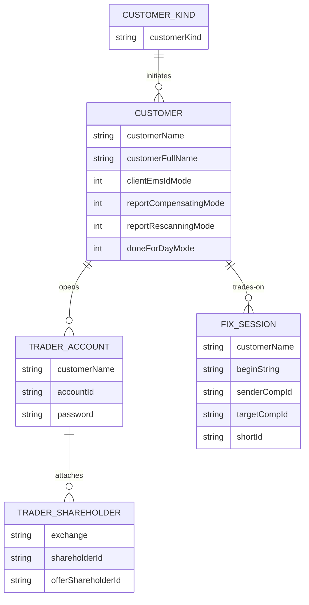

# Summary

增加完整的客户级别的配置支持。

1. 新增单独的表维护客户级别的配置信息 `xl_customer`
2. 在会话表 `xl_app_session_config` 中增加新列引用到关联的客户
3. 在资金账户表 `xl_trader` 中增加新列引用到关联的客户

从而形成如下的配置结构：

1. 一个客户会关联到多个资金账号
2. 一个资金账饕会关联到多个股东号
3. 一个客户会关联到多个 FIX 会话

本项工作会变更 [Implement-DMA-Specific-RuleChain](./Implement-DMA-Specific-RuleChain.md) 中关于 `dma-strategy` 配置项的部分。



# Goals

- 实现完整的客户级别配置支持
- 建立客户--资金账号--FIX会话之间的关联关系

# Non-Goals

* 重新设计配置加载方式
- 重新实现配置层级

# Motivation

1. 简化配置和管理

# Description

## 增加新的表 `xl_customer` 及对应 ORM 模型

```sql
CREATE TABLE `xl_customer` (
  `id` bigint NOT NULL AUTO_INCREMENT,
  `customer_kind` varchar(4) NOT NULL DEFAULT '' COMMENT 'Predefined customer kind (case insensitive). STD/MS/JS/OP/JP/VT/FT/GL/CT',
  `customer_name` varchar(8) NOT NULL DEFAULT '' COMMENT 'Unique identifying customer name (typically used for reference)',
  `customer_full_name` varchar(64) NOT NULL DEFAULT '' COMMENT 'Unique full customer name (typically used for information)',
  `client_ems_id_mode` tinyint NOT NULL DEFAULT '0' COMMENT 'Client(FIX) id from/to EMS id mapping mode (should not conflict with xl_trader). 0:Mapped;1:PassThrough;',
  `report_rescanning_mode` tinyint NOT NULL DEFAULT '0' COMMENT 'Report rescanning mode (should not conflict with xl_trader). 0:ReviewedPush;1:SkipPush;',
  `report_compensating_mode` tinyint NOT NULL DEFAULT '0' COMMENT 'Report compensating mode (should not conflict with xl_trader). 0:ReviewedPush;1:AutoPush;2:SkipPush;',
  `done_for_day_mode` tinyint NOT NULL DEFAULT '0' COMMENT 'Done for day mode (should not conflict with xl_trader). 0:Disabled;1:Regular;',
  `created_at` timestamp NOT NULL DEFAULT CURRENT_TIMESTAMP COMMENT 'Instant created current row (in +08:00 zone)',
  `last_updated_at` timestamp NOT NULL DEFAULT CURRENT_TIMESTAMP COMMENT 'Instant last updated current row (in +08:00 zone)',
  PRIMARY KEY (`id`)
);

CREATE UNIQUE INDEX uk_customer_uname ON `xl_customer`(`customer_name`);
CREATE UNIQUE INDEX uk_customer_fname ON `xl_customer`(`customer_full_name`);
```

其中，`customer_name` 设计用来区分同一客户的不同分组，如 "op_sec", "op_mar" 都是同一个 `customer_kind` 。

## 在 `xl_trader` 表中增加 `customer_name` 列关联到客户

```sql
ALTER TABLE `xl_trader`
ADD COLUMN `customer_name` varchar(8) NOT NULL DEFAULT '' COMMENT 'xl_customer.customer_name owning this trader';
```

默认值为 ""。需要手动维护资金账号所属的客户。

可以考虑建立外键约束。

## 在 `xl_app_session_config` 表中增加 `customer_name` 列关联到客户

```sql
ALTER TABLE `xl_app_session_config`
ADD COLUMN `customer_name` varchar(8) NOT NULL DEFAULT '' COMMENT 'xl_customer.customer_name owning this session';
```

默认值为 ""。需要手动维护会话所属的客户。

可以考虑建立外键约束。

## 为 `FixSessionScoped` 增加新的字段

增加新的会话所关联的客户（及相对应配置）和资金账号、股东卡信息等。

`FixSessionScoped` 数据会在 QuickFIX 在会话登陆时设置为线程本地变量；在 QuickFIX 的回调接口 `fromApp` 中被取出放到消息中。

## 增加新的 `com.citics.itst.xiangliu.bootstrap.transport.fix.FixSessionScopedLoader` 实现

修改已有的实现 `com.citics.itst.xiangliu.bootstrap.rdbms.FixSessionScopedLoaderImpl`，不做表关联查询，只返回会话对应的
`shortId`。

增加新的实现 `com.citics.itst.xiangliu.bootstrap.rdbms.FixSessionScopedLoaderCompactedImpl`，做表关联查询，返回会话对应的所有数据。该实现在 `gateway.rule-engine.compacted` 配置项打开的时候生效。

```toml
[gateway.rule-engine.compacted]
oms-new-ref = 'oms-new'
oms-cancel-ref = 'oms-cancel'
oms-exec-ref = 'oms-exec'

fix = 'incoming-fix-messages'
secitpdk = 'incoming-secitpdk-messages'
maritpdk = 'incoming-maritpdk-messages'
bypassitpdk = 'incoming-bypassitpdk-messages'
rejected = 'rejected-messages'
cats = 'incoming-cats-messages'
```

# Impact

## FIX Client

无

## CIFIX

代码重构。
