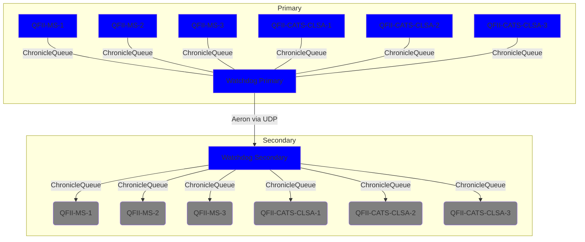
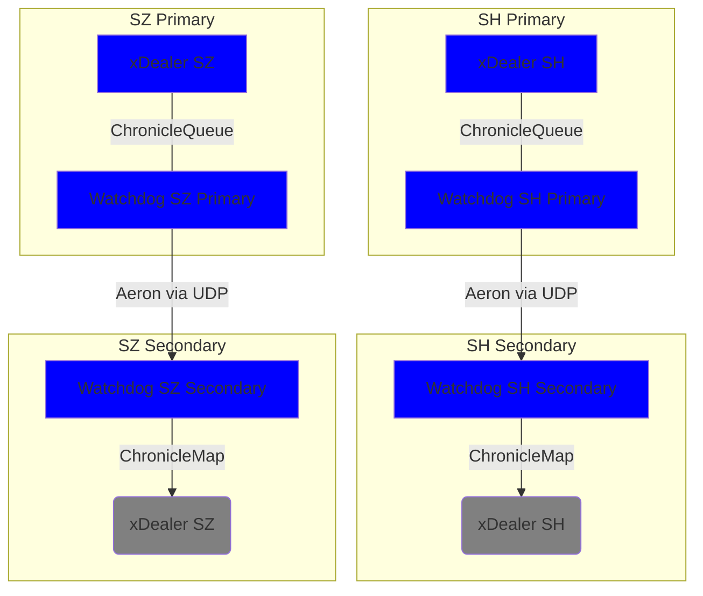
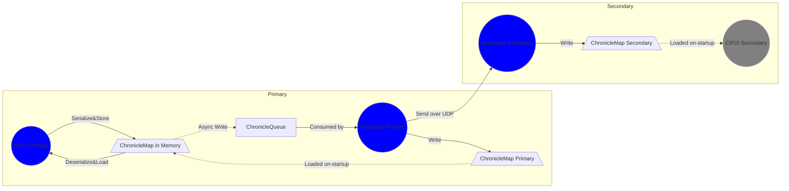
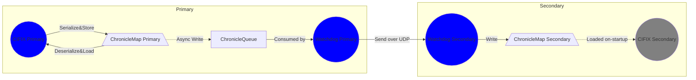

[[_TOC_]]

# Summary

改进 Watchdog 设计，使得在 Watchdog 可以支持多个 CIFIX 实例。一对 Watchdog 主备实例，可以支持在主实
例所在服务器上部署多个 CIFIX 实例对外提供服务（备实例所在服务器部署对应的 CIFIX 冷备实例）。



# Goals

1. 同一台服务器上一对 Watchdog 主备实例可以支持多个 CIFIX 实例

# Non-Goals

1. 修改持久化逻辑,优化持久化性能
2. 替换 ChronicleQueue 或 Aeron 组件

# Motivation

当前网关的主备逻辑是：CIFIX 主实例进行持久化操作后，会向一个无界队列提交一个主备同步任务；该队列的任
务会被后台的 [Disruptor](disruptor) 线程持久化写入 [ChronicleQueue][cq] 队列；同服务器上的 Watchdog
主实例会读取[ChronicleQueue](cq) 队列的数据一方面根据需求持久化到本地 [ChronicleMap](cm) 中，另一方
面通过 [Aeron](aeron) 发送到备机 Watchdog 实例，由 Watchdog 备实例进行持久化操作。

[disruptor]: https://github.com/LMAX-Exchange/disruptor "Disruptor"
[aeron]: https://github.com/real-logic/aeron "Aeron"
[cm]: https://github.com/OpenHFT/Chronicle-Map "ChronicleMap"
[cq]: https://github.com/OpenHFT/Chronicle-Queue "ChronicleQueue"



设计上，如果同一台服务器上部署多个 CIFIX 实例，则需要配套部署多对 Watchdog 主备实例。这明显不是一个
好的架构，并且也不符合运维的需求。

需要改造 Watchdog 机制，使得能够同一台服务器上的多个 CIFIX 实例只需要一对 Watchdog 实例。

# Description

## CIFIX Together with Watchdog (Existed)

主机上的 CIFIX 中使用 [ChronicleMap](cm) 通过K-V的方式进行数据的存储管理，数据存储在堆外内存或
`mmap` 文件中。数据写入 [ChronicleQueue](cq) 后，会通过 [Disruptor](disruptor) 单线程后台写入
[ChronicleQueue](cq)。主机上的 Watchdog会去消费 [ChronicleQueue](cq) 的消息，然后通过 [Aeron](aeron)

以 `UDP` 的方式发送给备机上的 Watchdog。备机 Watchdog 会将收到的数据写入 [ChronicleMap](cm) 中。

CIFIX 可以通过配置以两种方式使用 [ChronicleMap](cm)（主备配置一致）：

1. [ChronicleMap](chroniclemap) 纯内存模式：数据存放在堆外内存中
2. [ChronicleMap](cm) 文件`mmap`模式：数据存放在文件系统中

若使用纯内存模式，主 CIFIX 启动时会从本地的 [ChronicleMap](cm) 中加载数据到内存 [ChronicleMap](cm)
副本中；实时消息处理过程中，数据直接放在内存 [ChronicleMap](cm) 中；主 Watchdog 会将从
[ChronicleQueue](cq) 中读取的消息也写入到本地的 [ChronicleMap](cm) 中。



若使用文件`mmap`模式，主 CIFIX 启动时直接加载本地的 [ChronicleMap][cm]；实时消息处理过程中，数据通过
`mmap` 方式写入到本地 [ChronicleMap][cm] 中；主 Watchdog 不会写本地的 [ChronicleMap][cm]。



目前，CIFIX 中主要是基于 ChronicleMap 存储的三种数据需要进行主备同步。

1. LiveFix

    主要逻辑在 `ChronicleMapBasedLiveFixRepository` 中，存放的是：key 为委托ID，类型为 `long`；value 为委托的消息发送状态（已发送交易所确认、已发送交易所待报等），类型为 `int`。

2. OMS

    主要逻辑在 `ChronicleMapBasedOmsRepository` 中，存放的是：

    - 映射关系。key 为委托来源与来源ID，类型为 `String` + `String`；value 为委托ID，类型为 `long`
    - 报单消息。key 为委托ID，类型为 `long`；value 为报单数据，类型为复杂类型 `MutableOrder`
    - 撤单消息。key 为委托ID，类型为 `long`；value 为撤单数据，类型为复杂类型 `MutableCance`

3. FIX

    主要逻辑在 `ChronicleMapBasedFixMessagePersistence` & `ChronicleMapBasedFixSequencePersistence` 中，为每一个 FIX Session 存放：

    - FIX 双向序列号。key 为固定值，类型为 `int`；value 为 FIX 序列号，类型为 `int`
    - FIX 消息。key 为 FIX 序列号，类型为 `int`；value 为 FIX 消息，类型为 `String`

为了简化运维配置，主 CIFIX & 备 CIFIX 使用完全相同的配置文件；主 Watchdog & 备 Watchdog 使用完全相同
的配置文件。CIFIX & Watchdog 之间有 Chronicle 相关的配置需要保持一致。

1. [ChronicleMap][cm] 的配置（模式、本地路径、分块等）
2. [ChronicleQueue][cq] 的配置（路径等），注意：当前 [ChronicleQueue][cq] 的路径配置是基于 [ChronicleMap][cm] 的相对路径。

当前 Watchdog 收到消息后写入固定的 [ChronicleMap][cm] 中。如果多个 CIFIX 实例使用多个 [ChronicleMap][cm]，则
同一个 Watchdog 无法区分出来源的 CIFIX。

## CIFIX CQ 序列化逻辑变更

CIFIX 序列化到 [ChronicleQueue][cq] 的逻辑在 `ChronicleQueueGroup#ElementKind` 中：首先写入序列化的
类型(`short`)；然后分别按照源类型写入各自序列化的数据。这样的问题在于 Watchdog 收到序列化的字节后，
不能区分出是哪一个 CIFIX 实例发送出来的数据。

需要修改序列化逻辑，写入源实例的 instanceId (short)，参见 [Assign Instance ID on CIFIX Startup](Assing-Instance-ID-on-CIFIX-Startup.md)。

## ChronicleQueue 结构化目录设计 {.dedicated-cq}

`ElementKind` 的序列话逻辑支持了 instanceId ；但是考虑到序列化的性能，考虑支持不同 CIFIX
实例使用不同 [ChronicleQueue][cq] 实例的能力。为灵活起见，该功能可选可配置。

配置文件可以指定 [ChronicleQueue][cq] 实例的总目录(如 `cq/`)。

默认不启用此能力，则所有服务运行后使用同一个队列，形成类似于下面的目录结构：

```
linux %
🗁 cq/
└── 🗁 queues/
```

如果启用此能力，则各个实例在总目录下根据 instanceId 来隔离队列数据。所有服务运行后，会形成类似于下面的目录结构(假设启动了 6 个 CIFIX 实例，instanceId 分别为 10/11/12/20/21/22)：

```
linux %
🗁 cq/
├── 🗁 10.queues/
├── 🗁 11.queues/
├── 🗁 12.queues/
├── 🗁 20.queues/
├── 🗁 21.queues/
└── 🗁 22.queues/
```

所有的 CIFIX 实例和 watchdog 实例配置相同的 [ChronicleQueue][cq] 总路径 "cq/"；每一个运行的 CIFIX 实例根据自己的 instanceId 获取总路径下的子目录路径 "${instanceId}.queues"；
watchdog 实例枚举总路径下的子目录，读写所有 [ChronicleQueue][cq] 实例。

为了支持 watchdog 先于 CIFIX 实例启动的场景（乱序启动），需要 watchdog
动态检查总路径下的子目录，添加新的 [ChronicleQueue][cq] 实例。

## Watchdog CQ 反序列化逻辑变更

Watchdog 消费 [ChronicleQueue][cq] 进行反序列化时，需要解析出消息的来源 instanceId。

Watchdog 不再写 [ChronicleMap][cm]。取而代之的是，CIFIX 实例启动时从对应的 [ChronicleQueue][cq]
实例中读取数据重建现场。

作为参考，在一个通用配置的虚拟机上测试，读取 500w 数据量的 [ChronicleQueue][cq] 的耗时为 7s 左右。

## CIFIX CQ 配置变更

当前由于 [ChronicleMap][cm] 和 [ChronicleQueue][cq] 一对一地使用，所以二者的配置在同一个节点下面。

```toml
[gateway.chronicle]
data-dir = 'cmap'
oms-segments = 1
live-fix-segments = 1
fix-mode = 'NOOP'
oms-in-memory = true
live-fix-in-memory = true
fix-expected-messages = 500_000
oms-expected-orders = 300_000
oms-expected-cancels = 300_000

[gateway.cq]
enabled = true

[gateway.ha]
enabled = true
secondary-host = "${xdealer.ha.secondary-host}"

secondary-port = "${xdealer.ha.secondary-port}"
primary-host = "${xdealer.ha.primary-host}"
idle-interval = "${xdealer.ha.idle-interval}"
connect-timeout = "${xdealer.ha.connect-timeout}"
```

为了支持多个 CIFIX 可以使用同一个 Watchdog，需要将 [ChronicleQueue][cq] 的配置单独出来。[ChronicleQueue][cq] 的本地目录不再基于 `gateway.chronicle.data-dir`
目录自动生成，而是使用新的配置项 `gateway.cq.dir`。


```toml
[gateway.cq]
data-dir = 'cq/'
mode = 'shared' # or 'dedicated'
```

配置项 `gateway.cq.mode` 指示 [ChronicleQueue][cq] 的模式：`shared` 表示所有 CIFIX
实例使用同一个队列；`dedicated` 表示每个 CIFIX 使用各自的队列。参见 [ChronicleQueue 结构化目录设计](#dedicated-cq)。

由于这些配置是 CIFIX 和 Watchdog 都会读取的，可以考虑将其放到一个单独的配置文件里面。

## Watchdog CQ 配置变更

Watchdog 需要读取 `gateway.cq.data-dir` 和 `gateway.cq.mode` 的配置。

## 新增 `ha-support` Profile

为了简化配置，需要新增一个 Micronaut Profile `ha-support`（即增加一个
`application-ha-support.toml` 的配置文件）。

此配置文件里面存放同时被各 CIFIX 实例和 watchdog-primary & watchdog-secondary 实例共同使用的配置项，
当前主要是：

1. `gateway.cq.*`
2. `gateway.ha.*`

需要同步修改 `jmain.sh` 脚本：

1. 优先使用 `APP_MORE_PROFILES` 环境变量的值
2. 优先使用 `WORKING_DIR` 环境变量的值
3. 优先使用 `DEPLOYING_DIR` 环境变量的值

需要同步修改 `build_and_package_for_qfii.sh` & `build_and_package_for_xdealer.sh` &
`build_and_package_for_xdealer_rootnet.sh` 脚本：

1. 根据生产环境实际设置 `WORKING_DIR` & `DEPLOYING_DIR` 的值
2. `APP_MORE_PROFILES` 使用新增的 `ha-support` profile

需要同步修改 `build_and_package_for_watchdog.sh` 脚本：

1. `APP_MORE_PROFILES` 使用新增的 `ha-support` profile

# Testing

## 测试配置项加载

1. 新 profile 的加载
2. 新配置项的读取（及默认值）

## 测试 chronicle 配置同步

验证 Watchdog (primary+secondary) 在启动后能读取 CIFIX 实例的 instanceId 及关联配置：

1. 单 CIFIX 实例，且先于 Watchdog 实例启动
2. 单 CIFIX 实例，且晚于 Watchdog 实例启动
3. 多 CIFIX 实例，且均先于 Watchdog 实例启动
4. 多 CIFIX 实例，且均晚于 Watchdog 实例启动
5. 多 CIFIX 实例，且或先或晚于 Watchdog 实例启动

## 测试报单同步结果 watchdog-primary

验证报单及回报处理：

1. 单 CIFIX 实例，处理请求
2. 多 CIFIX 实例，处理请求

# Impact

## FIX Client

无影响。

## CIFIX Gateway

需要开发测试验证。

## HTS Proxy

无影响。

## HTS

无影响。

<!-- vim:set cuc cul nu ts=4 sw=4 ai si sr list ft=markdown: -->
